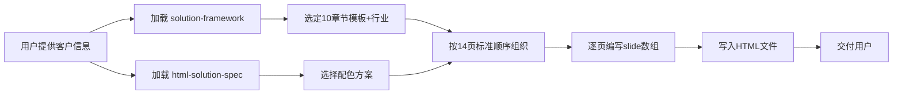

# HTML 售前方案编写规范

> **版本：v2.0** | 2026-05-14
>
> **数据来源：** 从 Open WebUI「售前知识库-解决方案」（KB ID: 7d1e8bfb）中读取了83份方案文件，深入分析了10+份代表性文档（美业、服务、汽车、酒水、HOKA、全棉时代、智慧零售、养老、胜道体育等），提取的标准结构。
>
> **本规范 = 知识库实际方案的模式提炼，不是凭空设计。**

---

## 一、核心理念

### 为什么 HTML > PPT

| 维度 | PPT（腾讯Slide） | HTML 自建 |
|------|----------------|----------|
| 排版控制 | 黑盒模板，无法精确控制 | **像素级控制** |
| 内容密度 | 模板强制压缩，空置率高 | **完全可控**，每页2-5个内容块 |
| 修改速度 | 重新生成耗时长 | 改HTML秒级生效 |
| 交互体验 | 线性翻页 | 键盘/触屏/进度条 |
| 跨设备 | 需下载或在线打开 | 浏览器直接打开，手机/电脑自适应 |
| 打印/投影 | 原生支持 | 添加 `@media print` 即可 |

### 核心原则

1. **一页一主题**：每页只讲一个核心观点，2-5个内容块，200-600字
2. **空置率 < 15%**：不留大面积空白，元素填充页面宽度
3. **来源必标**：每页右上角标注知识库来源
4. **数据真实**：所有数据/案例必须有据可查
5. **浅色主色**：白色/浅灰背景 + 深色文字，适合投影和打印

---

## 二、页面结构与顺序

### 标准方案顺序（来自知识库10+份实际方案的结构提炼）

知识库中所有方案文档遵循高度一致的结构：

| 页码 | 内容 | 类型 | 核心元素 | 详见知识库方案举例 |
|------|------|------|---------|-------------------|
| 1 | **封面** | 深色全屏 | 品牌名+标题+副标题+公司名 | 所有方案统一 |
| 2 | **目录** | 编号列表 | 4-6章节，编号+标题+副标题 | HOKA(目录4章)、全棉时代(4章) |
| 3 | **微盟介绍** | 品牌实力页 | 企业定位+发展历程时间轴+荣誉奖项+品牌墙 | 每份方案必含(篇幅通常2-3页，这里压缩为1页) |
| 4 | **行业洞察** | KPI大字+趋势 | 市场规模+KPI行+4趋势卡片+发展趋势 | 美业(8990亿/10-15%/200万+)、汽车(汽车流通行业) |
| 5 | **痛点全景** | 痛点矩阵 | 6大痛点×阶段标签+各痛点描述 | 美业(信息不对称→咨询慢→预约落后→信息不透明→记录不透明→缺乏召回)、汽车(价格倒挂/库存压力/转型成本) |
| 6 | **解决方案蓝图** | 分层架构 | C端→B端两层架构+触点层+运营层+数据层 | 美业/服务/智慧零售(消费者全链路运营+管理经营提效) |
| 7-10 | **功能模块** | 卡片/表格/旅程 | 每页一个核心模块 | 详见下方分页规则 |
| 7 | 消费者全链路 | 旅程步骤 | 各阶段(A→I→P→L)割页展示：认知→考量→服务+决策→用户增值 | 美业、服务(4阶段生命周期) |
| 8 | B端管理赋能 | 卡片 | 总部管理/门店管理/导购管理/数据提效 | 智慧零售(组织架构+权限+数据) |
| 9 | 多门店/多品牌架构 | 架构图 | 总部→区域→门店或品牌矩阵 | 智慧零售(多品牌+多业态+加盟/直营) |
| 10 | 私域运营/会员/导购 | 图文 | 会员体系/导购赋能/私域SOP，按需替代 | 美业(预约/核销/次卡) |
| 11 | **产品配置与报价** | 版本表 | 产品矩阵+版本选择+报价 | 可选，从solution-framework框架补充 |
| 12 | **案例** | 客户卡片 | 4-6品牌卡片+场景+成效 | HOKA(江南布衣/鄂尔多斯墙)、汽车(华宏绿动等) |
| 13 | **FAQ/问答** | 卡片 | 常见问题+解答 | 汽车(FAQ章节)、酒水(FAQ章节) |
| 14 | **结束页** | 深色全屏 | 感谢语+联系方式+品牌落款 | 所有方案统一 |

### 可变规则

| 客户类型 | 调整方向 |
|---------|---------|
| **小客户**（1-5店/单店） | 砍掉P3(微盟介绍)、P12(案例)、P13(FAQ)→精简到10页。重点放痛点(P5)+方案(P7-10)+报价(P11) |
| **大客户**（100+店/品牌） | 增：技术架构、数据安全、分阶段实施、SOW对接模块→扩到25-30页 |
| **老客户增购** | 去掉P4(行业背景)、P12(案例)，首页直接"本次新增需求"，P3微盟介绍精简为1段 |
| **竞品替换场景** | 增：P11改为竞品替代方案对比，增迁移路径页 |

---

## 三、排版系统

### 3.1 颜色系统

#### 浅色主题（推荐，投影/打印友好）

```css
:root {
  --bg:           #ffffff;   /* 页面背景 — 纯白 */
  --surface:      #f5f6f8;   /* 卡片/表格背景 — 浅灰 */
  --surface2:     #e8eaee;   /* 深一层的表面 */
  --border:       #d0d5dd;   /* 边框线 */

  /* 文字 */
  --text:         #1a1a2e;   /* 主文字 — 深蓝黑，对比度12.4:1 */
  --text2:        #475467;   /* 次要文字 — 中灰，对比度6.3:1 */
  --text3:        #98a2b3;   /* 辅助/标签文字，对比度3.1:1 — 仅用于标签 */

  /* 强调色（行业适配）*/
  --accent:       #5B3CC4;   /* 主色：紫色（零售通用） */
  --accent2:      #E85D75;   /* 辅色：玫红（女装/美业） */
  --accent3:      #2563EB;   /* 辅色：蓝（科技/金融） */

  /* 语义色 */
  --green:        #039855;
  --orange:       #DC6803;
  --red:          #D92D20;
  --blue:         #175CD3;

  --radius:       12px;
  --shadow:       0 1px 3px rgba(0,0,0,0.06), 0 1px 2px rgba(0,0,0,0.04);
}
```

#### 行业配色适配表

| 行业 | 主色(accent) | 辅色(accent2) | 思路 |
|------|-------------|--------------|------|
| **零售·女装** | `#5B3CC4` 紫 | `#E85D75` 玫红 | 时尚+高级感 |
| **零售·运动** | `#2563EB` 蓝 | `#039855` 绿 | 活力+专业 |
| **零售·母婴** | `#E85D75` 粉 | `#F59E0B` 橙 | 温暖+亲和 |
| **美业/服务** | `#C11574` 粉紫 | `#F59E0B` 金 | 品质+尊贵 |
| **餐饮** | `#DC6803` 橙 | `#E85D75` 红 | 食欲+热情 |
| **大健康/养老** | `#039855` 绿 | `#175CD3` 蓝 | 健康+信赖 |
| **汽车** | `#175CD3` 深蓝 | `#475467` 灰 | 稳重+专业 |
| **酒水/食品** | `#B54708` 棕 | `#DC6803` 橙 | 品质+沉淀 |

#### 封面/结束页深色方案

```css
/* 覆盖在.slide上即可 */
.cover-slide {
  background: linear-gradient(135deg, #0f0f13 0%, #1a1a2e 100%);
  color: #fff;
}
.cover-slide .cover-title { font-size: 56px; font-weight: 900; color: #fff; }
.cover-slide .cover-subtitle { font-size: 16px; color: #9898b0; }
.cover-slide .cover-tag { font-size: 13px; color: var(--accent); letter-spacing: 2px; }
.cover-slide .cover-meta { font-size: 14px; color: #9898b0; }
.cover-slide .cover-bottom { font-size: 12px; color: #5a5a72; letter-spacing: 2px; }
```

**对比度安全清单**：所有文字必须 ≥ 4.5:1
- `#1a1a2e` on `#ffffff` = **12.4:1** ✅
- `#475467` on `#ffffff` = **6.3:1** ✅
- `#475467` on `#f5f6f8` = **5.5:1** ✅
- `#9898b0` on `#ffffff` = **3.1:1** ❌ 仅标签用

### 3.2 字体层级

```css
@import url('https://fonts.googleapis.com/css2?family=Noto+Sans+SC:wght@300;400;500;600;700;900&display=swap');

h1 { font-size: 32px; font-weight: 700; line-height: 1.25; }    /* 页面大标题 */
h2 { font-size: 24px; font-weight: 600; line-height: 1.3; }     /* 章节标题 */
h3 { font-size: 18px; font-weight: 600; line-height: 1.4; }     /* 卡片/区域标题 */
h4 { font-size: 16px; font-weight: 600; line-height: 1.4; }     /* 小标题/表格项 */

p, li { font-size: 14px; line-height: 1.6; color: var(--text2); }

small, .tag, .badge { font-size: 12px; }
.source-tag { font-size: 12px; color: var(--text2); }
.kpi-num { font-size: 28px; font-weight: 700; color: var(--accent); }
.kpi-label { font-size: 12px; color: var(--text2); }
```

### 3.3 间距系统（8px 倍数）

```css
.mb-8  { margin-bottom: 8px; }
.mb-12 { margin-bottom: 12px; }
.mb-16 { margin-bottom: 16px; }
.mb-20 { margin-bottom: 20px; }
.mb-24 { margin-bottom: 24px; }
.mb-32 { margin-bottom: 32px; }
.mt-16 { margin-top: 16px; }
.mt-20 { margin-top: 20px; }
.mt-24 { margin-top: 24px; }
.gap-8  { gap: 8px; }
.gap-12 { gap: 12px; }
.gap-16 { gap: 16px; }
.gap-20 { gap: 20px; }
.gap-24 { gap: 24px; }

.slide { padding: 48px 72px; }
@media (max-width: 900px) {
  .slide { padding: 28px 20px; }
}
```

### 3.4 页面布局系统

```css
.slide {
  position: absolute; top: 0; left: 0;
  width: 100%; height: 100%;
  padding: 48px 72px;
  display: flex; flex-direction: column;
  opacity: 0; pointer-events: none;
  transition: opacity 0.4s ease;
  overflow-y: auto;
  background: var(--bg);
}
.slide.active { opacity: 1; pointer-events: auto; }

/* 网格 */
.grid-2 { display: grid; grid-template-columns: 1fr 1fr; gap: 16px; flex: 1; }
.grid-3 { display: grid; grid-template-columns: 1fr 1fr 1fr; gap: 14px; flex: 1; }
.grid-4 { display: grid; grid-template-columns: 1fr 1fr 1fr 1fr; gap: 12px; flex: 1; }

@media (max-width: 900px) {
  .grid-2, .grid-3, .grid-4 { grid-template-columns: 1fr; }
}

/* 双栏flex */
.flex-row { display: flex; gap: 20px; flex: 1; }
.flex-row > * { flex: 1; }
```

---

## 四、组件库

### 4.1 卡片（Card）— 最核心组件

```html
<div class="card">
  <div class="card-icon">📊</div>
  <h4>卡片标题</h4>
  <p>卡片正文描述，14px正文，1.6行高</p>
</div>
```

```css
.card {
  background: var(--surface);
  border: 1px solid var(--border);
  border-radius: var(--radius);
  padding: 16px 18px;
  transition: border-color 0.2s;
}
.card:hover { border-color: var(--accent); }
.card .icon { font-size: 22px; margin-bottom: 8px; }
.card h4 { font-size: 15px; font-weight: 600; margin-bottom: 4px; color: var(--text); }
.card p, .card li { font-size: 13px; color: var(--text2); line-height: 1.5; }
.card ul { padding-left: 14px; margin-top: 4px; }
.card ul li { margin-bottom: 2px; font-size: 13px; color: var(--text2); }

/* 彩色左边框 */
.card.accent  { border-left: 3px solid var(--accent);  background: #faf9ff; }
.card.pink    { border-left: 3px solid var(--accent2);  background: #fff8f9; }
.card.green   { border-left: 3px solid var(--green);    background: #f6fef9; }
.card.blue    { border-left: 3px solid var(--blue);     background: #f5faff; }
.card.orange  { border-left: 3px solid var(--orange);   background: #fffcf5; }
```

### 4.2 KPI 大字行 — 行业数据展示（知识库方案必用）

```html
<div class="kpi-row">
  <div class="kpi-item"><div class="kpi-num">8990亿+</div><div class="kpi-label">行业市场规模</div></div>
  <div class="kpi-item"><div class="kpi-num">10-15%</div><div class="kpi-label">年增长率</div></div>
  <div class="kpi-item"><div class="kpi-num">200万+</div><div class="kpi-label">全国门店数</div></div>
  <div class="kpi-item"><div class="kpi-num"><20%</div><div class="kpi-label">数字化渗透率</div></div>
</div>
```

```css
.kpi-row { display: flex; gap: 20px; margin-bottom: 20px; }
.kpi-item {
  flex: 1; background: var(--surface);
  border: 1px solid var(--border);
  border-radius: var(--radius);
  padding: 16px 20px; text-align: center;
}
.kpi-num { font-size: 28px; font-weight: 700; color: var(--accent); line-height: 1.2; }
.kpi-label { font-size: 12px; color: var(--text2); margin-top: 4px; }
@media (max-width: 900px) { .kpi-row { flex-wrap: wrap; } .kpi-item { min-width: 45%; } }
```

### 4.3 痛点矩阵 — 知识库方案标准组件

如美业方案（6大痛点×阶段标签）的标准写法：

```html
<div class="pain-matrix">
  <div class="pain-row">
    <div class="pain-stage">认知阶段</div>
    <div class="pain-content">
      <strong>信息不对称</strong>
      <p>用户不了解机构资质、技师水平及产品真伪，难以建立初步信任</p>
    </div>
  </div>
  <div class="pain-row">
    <div class="pain-stage">考量阶段</div>
    <div class="pain-content">
      <strong>咨询响应慢</strong>
      <p>客服回复不及时，无法提供有效信息，严重影响决策效率</p>
    </div>
  </div>
  <div class="pain-row">
    <div class="pain-stage">决策阶段</div>
    <div class="pain-content">
      <strong>预约方式落后</strong>
      <p>仅支持电话/微信预约，渠道单一，热门时段约不上</p>
    </div>
  </div>
  <div class="pain-row">
    <div class="pain-stage">服务阶段</div>
    <div class="pain-content">
      <strong>信息不透明</strong>
      <p>用户不清楚技师擅长领域、服务差异，影响服务满意度</p>
    </div>
  </div>
  <div class="pain-row">
    <div class="pain-stage">售后阶段</div>
    <div class="pain-content">
      <strong>记录不透明</strong>
      <p>用户无法查询储值余额、次卡剩余次数，引发信任危机</p>
    </div>
  </div>
  <div class="pain-row">
    <div class="pain-stage">忠诚阶段</div>
    <div class="pain-content">
      <strong>缺乏召回机制</strong>
      <p>用户忘记定期护理时缺乏系统化关怀与提醒，客户流失</p>
    </div>
  </div>
</div>
```

```css
.pain-matrix { display: flex; flex-direction: column; gap: 8px; }
.pain-row {
  display: flex; gap: 0;
  background: var(--surface);
  border: 1px solid var(--border);
  border-radius: 8px;
  overflow: hidden;
}
.pain-stage {
  width: 100px; min-width: 100px;
  display: flex; align-items: center; justify-content: center;
  font-size: 12px; font-weight: 600;
  color: #fff;
  background: var(--accent);
  padding: 8px;
  text-align: center;
}
.pain-content {
  flex: 1; padding: 10px 14px;
}
.pain-content strong { font-size: 14px; color: var(--text); display: block; margin-bottom: 2px; }
.pain-content p { font-size: 12px; color: var(--text2); margin: 0; }
```

### 4.4 客户全链路旅程 A→I→P→L（知识库方案标志性组件）

按照知识库美业/服务方案的"消费者全链路运营"模式：

```html
<div class="journey-lifecycle">
  <div class="jl-item">
    <div class="jl-icon">🔍</div>
    <div class="jl-letter">A</div>
    <div class="jl-label">认知 · Awareness</div>
    <div class="jl-desc">公域曝光引流<br>私域资产沉淀</div>
  </div>
  <div class="jl-arrow">→</div>
  <div class="jl-item">
    <div class="jl-icon">💭</div>
    <div class="jl-letter">I</div>
    <div class="jl-label">考量 · Interest</div>
    <div class="jl-desc">品牌内容可视化<br>提升消费者信任</div>
  </div>
  <div class="jl-arrow">→</div>
  <div class="jl-item">
    <div class="jl-icon">🛍️</div>
    <div class="jl-letter">P</div>
    <div class="jl-label">购买 · Purchase</div>
    <div class="jl-desc">一键预约到店<br>服务+决策转化</div>
  </div>
  <div class="jl-arrow">→</div>
  <div class="jl-item">
    <div class="jl-icon">❤️</div>
    <div class="jl-letter">L</div>
    <div class="jl-label">忠诚 · Loyalty</div>
    <div class="jl-desc">老带新裂变<br>UGC+KOC运营</div>
  </div>
</div>
```

```css
.journey-lifecycle {
  display: flex; align-items: center; gap: 0;
  flex: 1; justify-content: center;
}
.jl-item {
  text-align: center; padding: 12px;
  display: flex; flex-direction: column; align-items: center;
}
.jl-icon { font-size: 28px; margin-bottom: 6px; }
.jl-letter {
  width: 28px; height: 28px;
  border-radius: 50%;
  background: var(--accent); color: #fff;
  display: flex; align-items: center; justify-content: center;
  font-size: 13px; font-weight: 700;
  margin-bottom: 4px;
}
.jl-label { font-size: 12px; font-weight: 600; color: var(--text); margin-bottom: 4px; }
.jl-desc { font-size: 11px; color: var(--text2); line-height: 1.4; }
.jl-arrow { font-size: 20px; color: var(--border); margin: 0 4px; }

@media (max-width: 900px) {
  .journey-lifecycle { flex-wrap: wrap; }
  .jl-arrow { display: none; }
}
```

### 4.5 品牌客户墙 — 知识库每个方案都在用

```html
<div class="brand-wall">
  <div class="bw-title">行业集团型合作企业（部分）</div>
  <div class="bw-grid">
    <div class="bw-item">江南布衣集团</div>
    <div class="bw-item">鄂尔多斯集团</div>
    <div class="bw-item">太平鸟集团</div>
    <div class="bw-item">特步集团</div>
    <div class="bw-item">九牧王集团</div>
    <div class="bw-item">鸿星尔克集团</div>
    <div class="bw-item">斯凯奇集团</div>
    <div class="bw-item">百丽集团</div>
    <div class="bw-item">水星集团</div>
    <div class="bw-item">梦洁集团</div>
  </div>
</div>
```

```css
.brand-wall { flex: 1; display: flex; flex-direction: column; }
.bw-title { font-size: 13px; color: var(--text2); margin-bottom: 12px; }
.bw-grid {
  display: grid; grid-template-columns: repeat(5, 1fr);
  gap: 10px; flex: 1;
}
.bw-item {
  display: flex; align-items: center; justify-content: center;
  background: var(--surface); border: 1px solid var(--border);
  border-radius: 8px; padding: 14px 8px;
  font-size: 13px; font-weight: 500;
  color: var(--text);
}
@media (max-width: 900px) { .bw-grid { grid-template-columns: repeat(3, 1fr); } }
```

### 4.6 发展历程时间轴 — 知识库微盟介绍页标准组件

```html
<div class="history-timeline">
  <div class="ht-item"><span class="ht-year">2013</span><span class="ht-desc">微盟成立，推出首款SaaS产品</span></div>
  <div class="ht-item"><span class="ht-year">2018</span><span class="ht-desc">香港主板上市 (2013.HK)</span></div>
  <div class="ht-item"><span class="ht-year">2022</span><span class="ht-desc">发布微盟WOS，去中心化商业操作系统</span></div>
  <div class="ht-item"><span class="ht-year">2023</span><span class="ht-desc">发布微盟WAI，布局SaaS+AI</span></div>
</div>
```

```css
.history-timeline { display: flex; gap: 0; }
.ht-item {
  flex: 1; text-align: center;
  border-right: 1px solid var(--border);
  padding: 12px 8px;
}
.ht-item:last-child { border-right: none; }
.ht-year {
  display: block; font-size: 18px; font-weight: 700;
  color: var(--accent); margin-bottom: 4px;
}
.ht-desc { font-size: 11px; color: var(--text2); line-height: 1.4; }
```

### 4.7 分层架构图

```html
<div class="arch-stack">
  <div class="arch-layer accent" style="flex:1.2">
    <span class="arch-label">触点层</span>
    <span class="arch-items">小程序 · H5 · 企微 · 门店POS</span>
  </div>
  <div class="arch-layer" style="flex:1">
    <span class="arch-label">业务层</span>
    <span class="arch-items">会员 · 商品 · 订单 · 营销</span>
  </div>
  <div class="arch-layer" style="flex:1">
    <span class="arch-label">数据层</span>
    <span class="arch-items">CDP · MA · 数据中台</span>
  </div>
  <div class="arch-layer" style="flex:0.8">
    <span class="arch-label">底座</span>
    <span class="arch-items">WOS PaaS</span>
  </div>
</div>
```

```css
.arch-stack { display: flex; flex-direction: column; gap: 6px; flex: 1; justify-content: center; }
.arch-layer {
  background: var(--surface); border: 1px solid var(--border);
  border-radius: 8px; padding: 14px 20px;
  display: flex; align-items: center; justify-content: space-between;
}
.arch-layer.accent { background: #faf9ff; border-color: var(--accent); border-width: 1.5px; }
.arch-label { font-size: 14px; font-weight: 600; color: var(--text); min-width: 80px; }
.arch-items { font-size: 13px; color: var(--text2); }
```

### 4.8 横向时间轴（实施路径）

```html
<div class="timeline-h">
  <div class="tl-item">
    <div class="tl-dot"></div>
    <div class="tl-phase">第一阶段</div>
    <div class="tl-title">需求确认</div>
    <div class="tl-date">6月</div>
    <div class="tl-tasks">需求调研<br>方案设计<br>合同签署</div>
  </div>
  <div class="tl-item">
    <div class="tl-dot"></div>
    <div class="tl-phase">第二阶段</div>
    <div class="tl-title">系统部署</div>
    <div class="tl-date">7月</div>
    <div class="tl-tasks">环境搭建<br>系统对接<br>数据迁移</div>
  </div>
  <div class="tl-item">
    <div class="tl-dot"></div>
    <div class="tl-phase">第三阶段</div>
    <div class="tl-title">试运行</div>
    <div class="tl-date">8-9月</div>
    <div class="tl-tasks">门店培训<br>联调测试<br>UAT验收</div>
  </div>
  <div class="tl-item">
    <div class="tl-dot"></div>
    <div class="tl-phase">第四阶段</div>
    <div class="tl-title">正式上线</div>
    <div class="tl-date">10月</div>
    <div class="tl-tasks">全量上线<br>运营支持<br>持续优化</div>
  </div>
</div>
```

```css
.timeline-h { display: flex; flex: 1; position: relative; padding: 20px 0; }
.timeline-h::before {
  content: ''; position: absolute; top: 45px;
  left: 10%; right: 10%; height: 3px;
  background: var(--border);
}
.tl-item { flex: 1; display: flex; flex-direction: column; align-items: center; text-align: center; padding: 0 8px; position: relative; }
.tl-dot {
  width: 14px; height: 14px; background: var(--accent);
  border: 3px solid var(--bg); border-radius: 50%;
  margin-bottom: 10px; position: relative; z-index: 1;
  box-shadow: 0 0 0 3px var(--accent);
}
.tl-phase { font-size: 11px; color: var(--text3); text-transform: uppercase; margin-bottom: 4px; }
.tl-title { font-size: 14px; font-weight: 700; color: var(--text); margin-bottom: 2px; }
.tl-date { font-size: 12px; color: var(--accent); font-weight: 600; }
.tl-tasks { font-size: 12px; color: var(--text2); line-height: 1.5; margin-top: 6px; }
@media (max-width: 900px) { .timeline-h { flex-direction: column; gap: 16px; } .timeline-h::before { display: none; } }
```

### 4.9 数据表格

```html
<table class="data-table">
  <thead><tr><th>维度</th><th>微盟</th><th>竞品</th></tr></thead>
  <tbody>
    <tr><td><strong>门店管理</strong></td><td>多级架构，灵活配置</td><td>仅单层结构</td></tr>
    <tr><td><strong>会员运营</strong></td><td>OneCRM+MA体系</td><td>基础会员功能</td></tr>
  </tbody>
</table>
```

```css
.data-table { width: 100%; border-collapse: collapse; font-size: 13px; }
.data-table th { background: var(--surface); color: var(--text2); font-weight: 500; padding: 10px 14px; text-align: left; border-bottom: 2px solid var(--border); }
.data-table td { padding: 10px 14px; border-bottom: 1px solid var(--border); line-height: 1.5; color: var(--text2); }
.data-table td strong { color: var(--text); }
.data-table tr:hover td { background: var(--surface); }
```

### 4.10 标签/徽标

```html
<span class="badge badge-purple">L1 新客</span>
<span class="badge badge-pink">L2 活跃</span>
<span class="badge badge-green">L3 高净值</span>
<span class="badge badge-blue">L4 超级VIP</span>
<span class="badge badge-orange">待优化</span>
```

```css
.badge { display: inline-block; padding: 2px 10px; border-radius: 10px; font-size: 11px; font-weight: 500; }
.badge-purple { background: #ede9fe; color: #5B3CC4; }
.badge-pink   { background: #fce7f3; color: #C11574; }
.badge-green  { background: #d1fae5; color: #039855; }
.badge-blue   { background: #dbeafe; color: #175CD3; }
.badge-orange { background: #ffedd5; color: #DC6803; }
```

### 4.11 FAQ卡片 — 知识库方案标准收尾组件

```html
<div class="faq-grid">
  <div class="faq-item">
    <div class="faq-q">Q: 系统对接需要多长时间？</div>
    <div class="faq-a">视对接模块数量，通常4-6周（标准接口），定制开发需额外评估。</div>
  </div>
  <div class="faq-item">
    <div class="faq-q">Q: 数据迁移如何保障安全？</div>
    <div class="faq-a">采用加密传输+脱敏处理，迁移前后数据校验，支持回滚。</div>
  </div>
</div>
```

```css
.faq-grid { display: flex; flex-direction: column; gap: 10px; flex: 1; }
.faq-item {
  background: var(--surface); border: 1px solid var(--border);
  border-radius: 8px; padding: 14px 18px;
}
.faq-q { font-size: 14px; font-weight: 600; color: var(--text); margin-bottom: 4px; }
.faq-a { font-size: 13px; color: var(--text2); line-height: 1.5; }
```

---

## 五、每页设计规范

### 5.1 封面页

```html
<div class="slide cover-slide active">
  <div class="cover-content">
    <div class="cover-tag">全链路数字化增长方案</div>
    <h1 class="cover-title">[品牌名称]</h1>
    <p class="cover-subtitle">50家直营门店 · 会员体系 · 私域运营 · 多门店数字化升级</p>
    <div class="cover-divider"></div>
    <div class="cover-meta">
      <div>微盟售前咨询部</div>
      <div>2026年M月</div>
    </div>
    <div class="cover-bottom">微盟 · 让商业更智慧</div>
  </div>
</div>
```

**封面排版规则：**
- 标题56px、加粗900、纯白
- 副标题用 `#9898b0`（中等灰，避免纯灰看不清）
- 底部品牌名用小字 `#5a5a72`
- 分隔线强调色4-6px宽，80px长
- 所有文字居中

### 5.2 结束页（与封面统一风格）

```html
<div class="slide cover-slide">
  <div class="cover-content">
    <h1 class="cover-title">感谢聆听</h1>
    <p class="cover-subtitle">微盟 · 让商业更智慧</p>
    <div class="cover-divider"></div>
    <div class="cover-meta">
      <div>微盟售前咨询部</div>
      <div>朱鸣超 · weimob@weimob.com</div>
    </div>
  </div>
</div>
```

### 5.3 内容页标准结构

```html
<div class="slide">
  <div class="source-tag">来源：知识库·美业方案</div>
  <h1>行业痛点与背景</h1>
  <p class="subtitle">当前行业面临的X大核心挑战</p>
  <div class="kpi-row">...</div>
  <div class="grid-2 flex-1">
    <div class="card accent">...</div>
    <div class="card pink">...</div>
  </div>
</div>
```

### 5.4 微盟介绍页标准结构（知识库每份方案都有的核心页）

```html
<div class="slide">
  <h1>中国领先的智慧商业服务提供商</h1>
  <div class="kpi-row" style="margin-bottom:12px">
    <div class="kpi-item"><div class="kpi-num">7500+</div><div class="kpi-label">员工</div></div>
    <div class="kpi-item"><div class="kpi-num">1600+</div><div class="kpi-label">服务商</div></div>
    <div class="kpi-item"><div class="kpi-num">30+</div><div class="kpi-label">省市覆盖</div></div>
    <div class="kpi-item"><div class="kpi-num">10+</div><div class="kpi-label">分子公司</div></div>
  </div>
  <div class="history-timeline mb-20">
    <div class="ht-item"><span class="ht-year">2013</span><span class="ht-desc">微盟成立</span></div>
    <div class="ht-item"><span class="ht-year">2018</span><span class="ht-desc">香港主板上市</span></div>
    <div class="ht-item"><span class="ht-year">2022</span><span class="ht-desc">发布WOS系统</span></div>
    <div class="ht-item"><span class="ht-year">2023</span><span class="ht-desc">微盟WAI布局</span></div>
  </div>
  <div class="brand-wall">
    <div class="bw-title">行业集团型合作企业（部分）</div>
    <div class="bw-grid">
      <div class="bw-item">江南布衣集团</div>
      <div class="bw-item">鄂尔多斯集团</div>
      <div class="bw-item">太平鸟集团</div>
      <div class="bw-item">特步集团</div>
      <div class="bw-item">九牧王集团</div>
    </div>
  </div>
</div>
```

---

## 六、导航与交互

```html
<!-- 进度条 -->
<div class="progress" id="progressBar" style="width:0"></div>

<!-- 页码 -->
<div class="slide-counter" id="slideCounter">
  <span id="currentPage">1</span> / <span id="totalPages">N</span>
</div>

<script>
/* 翻页引擎 — 懒加载模式（每次只渲染当前+相邻页）*/
const slides = [ /* ...每页的innerHTML... */ ];
let current = 0;

function render() { /* 只渲染active和±1页到DOM */ }
function goToSlide(n) { current = (n + slides.length) % slides.length; render(); updateUI(); }
function nextSlide() { goToSlide(current + 1); }
function prevSlide() { goToSlide(current - 1); }

/* 键盘 */
document.addEventListener('keydown', e => {
  if (e.key === 'ArrowRight'||e.key==='ArrowDown') nextSlide();
  if (e.key === 'ArrowLeft'||e.key==='ArrowUp') prevSlide();
});

/* 触屏 */
let tx = 0;
document.addEventListener('touchstart', e => { tx = e.touches[0].clientX; });
document.addEventListener('touchend', e => {
  const d = tx - e.changedTouches[0].clientX;
  if (Math.abs(d) > 50) d > 0 ? nextSlide() : prevSlide();
});

/* 进度条 */
function updateUI() {
  document.getElementById('progressBar').style.width = ((current+1)/slides.length*100).toFixed(1)+'%';
  document.getElementById('currentPage').textContent = current + 1;
}
</script>
```

```css
.progress {
  position: fixed; top: 0; left: 0;
  height: 3px;
  background: linear-gradient(90deg, var(--accent), var(--accent2));
  z-index: 1000;
  transition: width 0.4s ease;
}
.slide-counter {
  position: fixed; bottom: 24px; right: 32px;
  font-size: 13px; color: var(--text2);
  z-index: 100;
  background: rgba(255,255,255,0.85);
  padding: 4px 14px; border-radius: 20px;
  backdrop-filter: blur(4px);
  box-shadow: var(--shadow);
}
```

---

## 七、来源标注规范

### 每页必须标注

```html
<div class="source-tag">来源：知识库·美业方案</div>
<div class="source-tag">来源：知识库·HOKA项目汇报</div>
<div class="source-tag">来源：知识库·全棉时代解决方案</div>
<div class="source-tag">来源：知识库·汽车行业方案</div>
<div class="source-tag">来源：SPICED案例库·报喜鸟</div>
<div class="source-tag">来源：solution-framework·行业洞察</div>
<div class="source-tag">来源：SOW标准·服装模块</div>
<div class="source-tag">来源：服装行业洞察</div>
```

### 标注位置
- 统一在内容页的左上角，`.source-tag`
- 格式：`来源：[库名]·[文件名/章节]`
- 封面和结束页不标注

### 禁止标注
- ❌ 客户自己提供的信息（如门店数、上线时间）
- ❌ 常识性信息（如"微信有12亿用户"）
- ❌ 自己推理/设计的内容（标注"方案框架推理"而非虚构来源）

---

## 八、内容密度检查清单

每页交付前自检：

- [ ] 至少2个内容块，理想3-5个（不是纯标题+1段文字）
- [ ] 无大面积空白（> 15% 页面面积空白 = 不合格）
- [ ] 卡片/表格/KPI大字/时间线 多种元素交替使用
- [ ] 每页正文200-600字区间
- [ ] 来源标签清晰（格式统一）
- [ ] 颜色不超过3种（深色页除外）+ 语义色
- [ ] 相邻页面不使用完全相同的布局
- [ ] 对比度符合4.5:1标准
- [ ] 页码 + 进度条正常显示

---

## 九、方案产出工作流



### 快速启动

当用户说"帮我写方案"时：
1. **加载** `solution-framework` skill → 获取10章节模板
2. **加载** `html-solution-spec` skill（本规范）
3. **执行**：按此规范的14页顺序 + 组件 + 配色 → 输出完整HTML文件

---

## 十、模板文件

见 `templates/minimal-solution-template.html` — 最小可运行HTML模板，包含：
- 浅色主题CSS变量（零售女装配色）
- 封面+内容页+结束页3页演示
- 所有组件CSS定义
- 翻页逻辑（键盘+触屏）
- 进度条+页码

---

## 版本历史

| 版本 | 日期 | 更新内容 |
|------|------|---------|
| v1.0 | 2026-05-14 | 初版，基于solution-framework、SPICED、URBAN HTML实践 |
| **v2.0** | **2026-05-14** | **基于「售前知识库-解决方案」10+份真实方案重构**：修正页面顺序（加入微盟介绍页/A→I→P→L旅程/FAQ结尾）、新增组件（品牌墙/痛点矩阵/发展历程/A→I→P→L旅程/FAQ卡片）、修正设计语言（加入"中国领先的智慧商业服务提供商"标准定位语） |